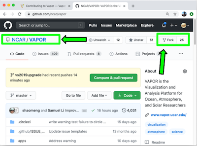
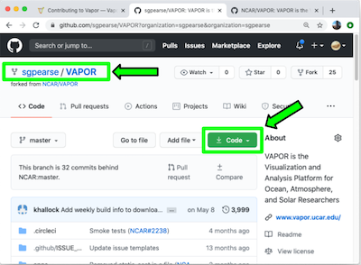
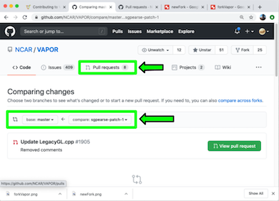
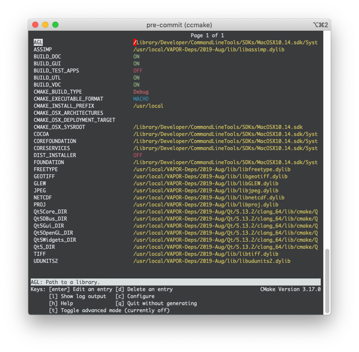

.. _contributing:

=====================
Contributing to Vapor
=====================

.. contents:: Table of contents:
   :local:
   :depth: 1

.. note::

  Parts of this document are derived from the `xarray Contributing
  Guide <http://xarray.pydata.org/en/stable/contributing.html>`_.

Where to start?
---------------

All contributions are welcome, and can include:

    - :ref:`Bug reports <contributing.bugReports>`
    - :ref:`Feature requests <contributing.bugReports>`
    - :ref:`Code contributions <contributing.git>`
    - :ref:`Documentation updates <contributing.documentation>`
    - :ref:`Your own visualizations to share in Vapor's gallery <contributing.visGallery>`

Vapor's current to-do list can be found on our `GitHub "issues" tab <https://github.com/ncar/vapor/issues>`_.  

If you’ve found an interesting issue that you would like to help fix, write a comment stating that you would like to be assigned to it.  Assigning issues to one or more individuals helps coordination among developers.

After assignment, you can refer to this document to :ref:`set up your development environment <contributing.environment>`, and then make your contribution.  The purpose of this guide is to help developers understand what part of Vapor's architecture is relevant to their assigned issue, and how to get their fix incorporated into our *master* branch.

Feel free to ask questions on the `Vapor Discourse Forum <https://vapor.discourse.group>`_.

.. _contributing.bugReports:

Bug Reports and Feature Requests
--------------------------------

To submit a new bug report or feature request, you can click the "New issue" button in the upper right of our `GitHub issue tracker <https://github.com/ncar/vapor/issues>`_, or by `clicking on this link <https://github.com/NCAR/VAPOR/issues/new/choose>`_.

Bug reports are an important part of making Vapor more stable.  A bug report should have a brief description of the problem, as well as a list of steps to reproduce the problem.  See `this stackoverflow article <https://stackoverflow.com/help/mcve>`_ for tips on writing a good bug report.

If you're building Vapor from its source code and find a bug, always try to reproduce your bug on the *master* branch.  

It is also worth searching for existing bug reports and pull requests to see if the issue has already been reported and/or fixed.  It's possible that a bug may be fixed, but it has not been merged into *master* or incorporated into a current installer.

.. _contributing.git:

Code Contributions
---------------------

If you've found an issue you'd like to fix, you'll need to compile Vapor, fix the issue at hand, and submit your changes for review and approval.  Prerequisite software includes:

    * Git for Vapor's version control
      
    * CMake (version 3.2 or higher) for Vapor's build system
      
    * One of the following compilers, dependent on which operating system you're using:

        * OSX - LLVM 10.0.1 (clang-1001.0.46.4)
        * Ubuntu/CentOS - g++ 7.5.0 or higher
        * Windows - Microsoft Visual Studio 2015, version 14

Version control, Git, and GitHub
________________________________

To a new developer, working with Git is one of the more daunting aspects of contributing to *Vapor*.  It can very quickly become overwhelming, but sticking to the guidelines below will help keep the process straightforward and mostly trouble free.  As always, if you are having difficulties please feel free to `ask for help <https://vapor.discourse.group>`_.

Vapor's code is hosted on `GitHub <https://www.github.com/NCAR/vapor>`_. To contribute you will need to sign up for a `free GitHub account <https://github.com/signup/free>`_. We use `Git <http://git-scm.com/>`_ for version control to allow many people to work together on the project.  Git can also be acquired by package managers like apt-get (Ubuntu), yum (RedHat), and choco (Windows).

The `GitHub help pages <http://help.github.com/>`_ are a great place to get started with Git.

`GitHub also has instructions <http://help.github.com/set-up-git-redirect>`__ for installing git,
setting up your SSH key, and configuring Git.  All these steps need to be completed before
writing code for Vapor. 

.. _contributing.environment:

Forking Vapor's code
____________________

After installing Git and registering with GitHub, it's time to "Fork" Vapor's code base by clicking the Fork button on the upper right corner of `Vapor's GitHub repository <https://github.com/NCAR/VAPOR>`_.  This creates your own repository on GitHub that contains a copy of Vapor's current master branch.  



     Click the "Fork" button in the top-left corner of we website.



     The newly created fork, based off Vapor's master branch.  Note the new repository name (sgpearse/VAPOR).  This is the repository you will clone from.

Clone your forked repository to a suitable location on your local work machine.  This new remote repository is what will be merged with Vapor's master branch once your changes have been made.

After completing your work, your changes can be submitted for review through a Pull Request from your Fork, into Vapor's master repository.  This is done under the Pull Requests tab in Vapor's github repository.  From this tab, create a new pull request that brings the changes from your forked repo into Vapor's master repo.  More details on this step are included in the :ref:`Submitting Your Changes <contributing.submitting>` section of this document.

For more information on the Forking Workflow, please see `Atlassian has a tutorial <https://www.atlassian.com/git/tutorials/comparing-workflows/forking-workflow>`_ on basics and best practices.



     Submitting a pull request to Vapor's master branch.

Third-Party Libraries
_____________________

Download pre-built Third-Party Libraries
****************************************

This is the recommended approach for acquiring the third-party libraries that Vapor depends on.  If you require additional libraries, or custom settings to the libraries currently used by vapor, see the :ref:`Building Third-Party Libraries section <contributing.build3rdParty>`.

After forking your new Vapor repository and cloning from it, you can download pre-built third-party libraries from the links below.  Be sure to select the correct libraries for the operating system you're building on.

.. note:: These libraries must be placed in the directory specified above their respective links.

*Windows*

Unzip the following file linked below into the root of your C:\\ directory.

    `Windows third party libraries <https://drive.google.com/open?id=1sE-mTQCa8MCUOVEgw-6ksT80ebmDVsu4>`_

*Linux and OSX*

If building on Linux or OSX, the third party libraries must be placed in /usr/local/VAPOR-Deps/.

    `OSX third-party libraries <https://drive.google.com/open?id=1Q-IXlP_OgZSXsWKmT-smyrW9xnR-dUfg>`_

    `Ubuntu third-party libraries <https://drive.google.com/open?id=1v0AwfOnDsf8hMzBqg4OcEtcEyH5YpnIn>`_

    `CentOS third-party libraries <https://drive.google.com/open?id=1S9DwySMnQrBuUUZGKolD__WQrjTmLgyn>`_

.. _contributing.build3rdParty:

Building Third-Party Libraries
******************************

This is an alternative to downloading our pre-built libraries that allows you to configure and store them wherever you want.  This is a more complex exercise.  If you choose to do this, you must also configure Vapor's CMake configuration to point to your custom directory.  

If you wish to go down this route, you may follow the build instructions for `Windows <https://drive.google.com/a/ucar.edu/file/d/1nPZyNtH516D00Te2AwttRrPDTi0bDIbl/view?usp=sharing>`_ and `UNIX <https://docs.google.com/document/d/1XNBmoUvxGn9I0fy9xvB1m5PQyOI32TtdyMbwfOve0QQ/edit?usp=sharing>`_.

.. note:: In order for Vapor to generate installers, all third-party libraries must be built in the same directory.

.. note:: The file <vapor-source>/site_files/site.NCAR may be used in lieu of CMake to specify the location of your party libraries.  Edit this file to specify your choice.  CMake variables passed over the command line may be overwritten by this file's presets.

+-----------------+----------------------------------------------------------------+
| *Vapor 3 was built with the following third party library configuration.*        |
+-----------------+----------------------------------------------------------------+
| Library         | Version                                                        |
+-----------------+----------------------------------------------------------------+
| assimp          | 4.1.0                                                          |
+-----------------+----------------------------------------------------------------+
| freetype        | 2.10.1                                                         |
+-----------------+----------------------------------------------------------------+
| glew            | 2.1.0                                                          |
+-----------------+----------------------------------------------------------------+
| hdf5            | 1.10.5                                                         |
+-----------------+----------------------------------------------------------------+
| jpeg            | 9c                                                             |
+-----------------+----------------------------------------------------------------+
| libgeotiff      | 1.5.1                                                          |
+-----------------+----------------------------------------------------------------+
| udunits         | 2.2.26                                                         |
+-----------------+----------------------------------------------------------------+
| netCDF          | 4.7.0                                                          |
+-----------------+----------------------------------------------------------------+
| tiff            | 4.0.10                                                         |
+-----------------+----------------------------------------------------------------+
| proj            | 6.1.1                                                          |
+-----------------+----------------------------------------------------------------+
| python          | 3.6.9                                                          |
+-----------------+----------------------------------------------------------------+
| Qt              | 5.13.2                                                         |
+-----------------+----------------------------------------------------------------+
| Ospray          | 2.4.0                                                          |
+-----------------+----------------------------------------------------------------+

.. note:: Different versions of Qt have presented bugs.  It's reocmmended that developers use the same library versions as those listed above, especially for Qt.

The source code for these libraries by be downloaded `here <https://drive.google.com/open?id=1sWIV-Y66aFuDkC2oDnceIIUJDDH4puKI>`_.

Install System Libraries
________________________

Building Vapor from source requires system libraries that are not natively available on all UNIX platforms.  The following commands can be used to acquire these libraries.

Ubuntu:
    sudo apt-get install git freeglut3-dev libexpat1-dev libglib2.0-0 libdbus1-3

CentOS:
    sudo yum install dbus make freeglut-devel expat-devel libquadmath-devel libXrender-devel libSM-devel fontconfig-devel

.. note::
    Vapor uses docker images as a basis for its continuous integration test suite, which are built from Dockerfiles located in <source-directory>/share/docker.  The docker files in this directory can be used as a reference to how our different test systems build Vapor.

Build Vapor with CMake
______________________

On all operating systems, create a directory where the build will take place.  One option is to put the build directory inside of the Vapor source code directory.

    > cd VAPOR
    > mkdir build
    > cd build

Windows
    Enter your build directory as the "Where to build the binaries" field in the CMake GUI.  Click *Configure*, *Generate*, and then *Open Project* in that order.  Visual Studio will open, and you can build the target *PACKAGE* to compile the source code.

UNIX:
    Navigate to your build directory and run the command *cmake <source_directory>*, where <source_directory> is the root directory of Vapor's source code.  If the configuration was successful, you can then run *make* to compile Vapor.

    cmake .. && make

If compilation is successful, you can find Vapor's executable in the *bin* directory within your *build* directory.

Changing CMake Variables
````````````````````````

Some users may want their build to target a different library than what is distributed with Vapor's 3rd party library bundle.  Different libraries can be targetted in two ways, 1) through the *ccmake* tool, and 2) by editing the file located in <source-directory>/site_files/site.NCAR.

ccmake
======

Cmake provides an interface to set build variables called *ccmake*.  From your build directory, you can issue the ccmake command, followed by the path to Vapor's source code.  If your build directory is in <source_directory>/build, issuing ccmake from this directory would look like this:

    ccmake ..



     ccmake's interface for changing build variables after issuing "*ccmake ..*" on Vapor's source directory.  This is assuming your build directory is in <vapor_source>/build.

The above interface allows you to set targets for some (but not all) of Vapor's libraries.  `More information on ccmake can be found here. <https://cmake.org/cmake/help/v3.0/manual/ccmake.1.html>`_  Your changes will be saved in your build directory in a file named CMakeLists.txt.  If this file gets deleted, your changes will be lost.  To set your libraries in a more permanent fashion, you can edit the site.NCAR file, described below.

site.NCAR
=========

The site.NCAR file is what is used by the Vapor team to define what third party libraries a build should link to.  This file is located at <vapor_source>/site_files/site.NCAR, and contains conditionals for buildong on Darwin (OSX), Windows, and Linux (Ubuntu/CentOS).  There are also conditionals for building on NCAR's visualization cluster, Casper.

The THIRD_PARTY_DIR variable in this file may be overloaded to re-target the location of Vapor's libraries.  Special values exist for the Qt and Python libraries becasuse they are built outside of the THIRD_PARTY_DIR, and must be manually overridden.  These variables are:

+---------------------+-----------------------------------------------------------------+
| QTDIR               | Directory where the Qt library has been built/installed         |
+---------------------+-----------------------------------------------------------------+
| Qt5Core_DIR         | Directory where the Qt5Core shared library was built/installed  |
+---------------------+-----------------------------------------------------------------+
| QT_QMAKE_EXECUTABLE | Location of Qt's QMake executable                               |
+---------------------+-----------------------------------------------------------------+
| PYTHONDIR           | Directory containing Python's libraries and headers             |
+---------------------+-----------------------------------------------------------------+
| PYTHONPATH          | Directory containing Python's site packages                     |
+---------------------+-----------------------------------------------------------------+
| PYTHONVERSION       | Version of Python                                               |
+---------------------+-----------------------------------------------------------------+
| NUMPY_INCLUDE_DIR   | Directory containing numpy's header files                       |
+---------------------+-----------------------------------------------------------------+
| OSPRAYDIR           | Directory containing Ospray's librarieses                       |
+---------------------+-----------------------------------------------------------------+

Adding to the Code Base
_______________________

After successfully compiling Vapor, you can make changes to the code base.  Make sure to follow Vapor's `Code Conventions <https://github.com/NCAR/VAPOR/wiki/Vapor-Coding-Convention>`_.  If building on a UNIX system, eliminate all compiler warnings.

What pieces of code you add or modify will depend on the issue you're trying to fix.  Most often, contributors will be doing one of two things:

.. toctree::
   :maxdepth: 1

   createDataReader
   createRenderer

Build and Test an Installer
___________________________

Before submitting your changes for review, it's worth the time to build an installer to see if libraries are properly linked, and optimized code works correctly.

To build an installer, run *ccmake <vapor-source-dir>* so that the field *CMAKE_BUILD_TYPE Debug* is changed to *CMAKE_BUILD_TYPE Release*.  Also change the field *DIST_INSTALLER OFF* to be *DIST_INSTALLER ON*.  Alternatively to ccmake, you can hand-edit the file CMakeLists.txt, which is located in the root of Vapor's source directory.

On Windows, make sure that the Visual Studio setting for the build is in *Release* mode, not *Debug*, and build the target *PACKAGE*.

On OSX, run *cmake <vapor-source-dir> && make && make installer* from your build directory.

On Linux, run  *cmake <vapor-source-dir> && make linuxpreinstall && make installer* from your build directory.

.. _contributing.submitting:

Submitting Your Changes
_______________________

After your implementation is complete, push your commits to your forked repository on GitHub.  Then submit your changes you've made on your forked branch to Vapor's master branch as a GitHub Pull Request.

Vapor will automatically run a small set of tests to see if its internals are in tact, and check for warnings.  If these tests pass, Vapor's team will review the Pull Request to make sure that Vapor's `Code Conventions <https://github.com/NCAR/VAPOR/wiki/Vapor-Coding-Convention>`_ were honored, and that the logic and structure of the code is sound.  

After review, further changes may be requested.  If everything looks good, the Pull Request will be merged into Vapor's master repository.


`Vapor Coding Conventions <https://github.com/NCAR/VAPOR/wiki/Vapor-Coding-Convention>`_
________________________________________________________________________________________

.. _contributing.documentation:

Contributing to Vapor's Documentation
-------------------------------------

Vapor uses the `Sphinx <https://www.sphinx-doc.org/en/master/>`_ documentation generator.  

To contribute to Vapor's documentation, first follow these `instructions for installing Sphinx <https://www.sphinx-doc.org/en/master/usage/installation.html>`_.

After installing sphinx, you will have a program called *sphinx-build* available.  You can find its location by typing the command *which sphinx-build*.  This location needs to be applied to the *SPHINXBUILD* variable, at line 6 in <vapor-install-dir>/docs/sphinx/Makefile.

Once the makefile has been modified, navigate to <vapor-install-dir/docs/sphinx.  Within this directory you will find .rst files that Sphinx uses to generate the HTML used for Vapor's documentation.  You can modify these .rst files, or add new ones.  

Once the .rst file changes are complete, type *make ..* from the <vapor-build-dir>/docs/sphinx directory.  This will generate the HTML, which will be saved in <vapor-install-dir>/docs.  The HTML and .rst files can then be committed in Git, and added to a pull request for review.

.. _contributing.visGallery:

Contributing to Vapor's Gallery
-------------------------------

Contributing to `Vapor's visualiation gallery <https://visgallery.ucar.edu/category/visualization-software/vapor/>`_ helps us understand how the application is being used, and can drive future requirements.  If you'd like to share your visualizations with us, you can submit them to our gallery by filling out the following form:

`Submit a visualization to Vapor's gallery <https://docs.google.com/forms/d/e/1FAIpQLSdJQA_1LGZ-DNySLGn4c9TekVuUcwvKo4Hgw3uBf9BmSDipUw/viewform?vc=0&c=0&w=1>`_


