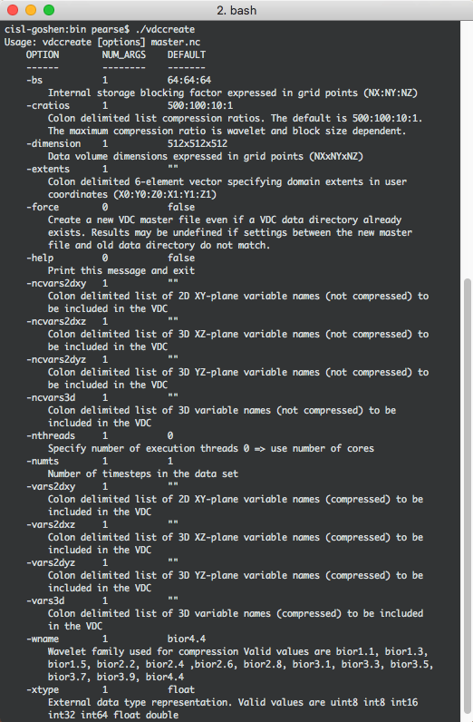
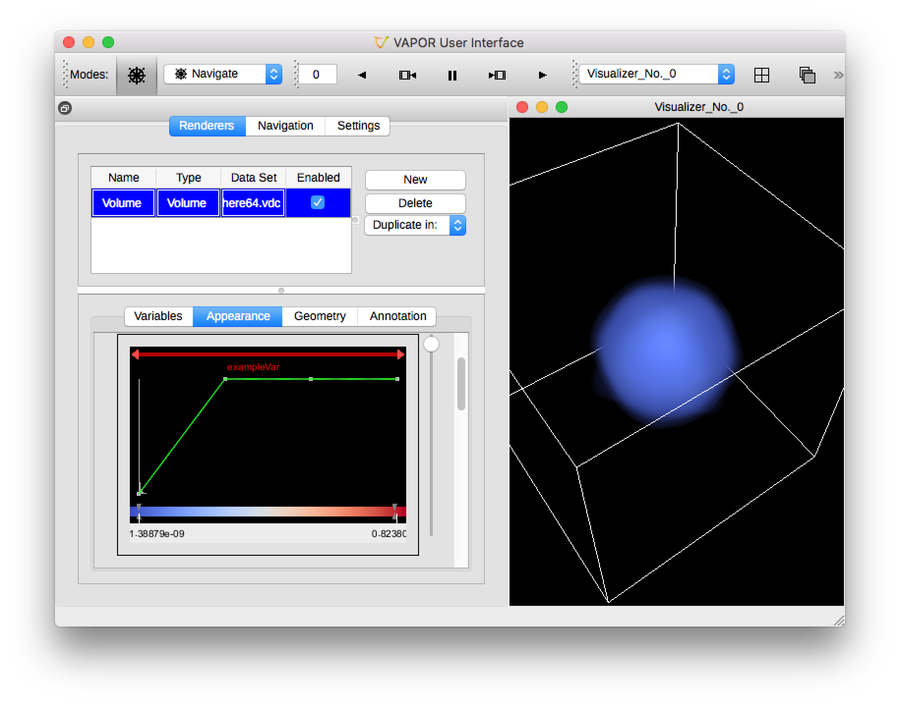
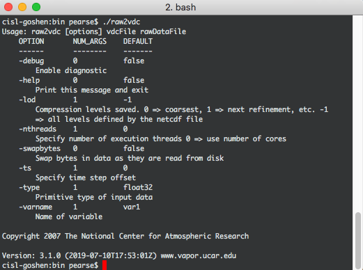

:orphan:

.. _binary:

Raw Binary Data
```````````````

Converting raw binary data to VDC is a complex process for converting data in Vapor 3.  With WRF-ARW and NetCDF-CF data, Vapor can read the files an extract metadata that describes the grid that the data exists within.  With raw binary data, we need to define that metadata ourselves in step 1.

Step 1: Create .vdc metadata file
_________________________________

To make a VDC from scratch, users need to carefully read all options in the ``vdccreate`` utility, and define their .vdc metadata file accordingly.

In this `sample dataset of a sphere <https://drive.google.com/open?id=1wJtPX0DPgovZSulAC8kntDKVcDkTw1Y7>`_, we have a 64x64x64 rectilinear grid with one timestep, and one 3D variable.  For this example, we can create a .vdc metadata file with the following flags from vdccreate.  Note that we are not using the raw data file yet, just defining the grid, time dimension, and variables.

    ``vdccreate -dimension 64x64x64 -numts 1 -vars3d exampleVar sphere64.vdc``



    Command line arguments for vdccreate, seen by issuing the command without any arguments

Step 2: The wavelet transform
_____________________________

Now that a .vdc metadata file has been created, the VDC transform can take place.  Each variable must be converted individually with ``raw2vdc``, and this must be done one timestep at a time.

    ``raw2vdc -ts 0 -varname exampleVar sphere64.vdc sphere64.raw``



    A volume rendering of our sphere, converted from raw binary data.



    Command line arguments for raw2vdc wavelet transform, seen by issuing the command without any arguments.
