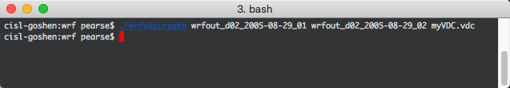
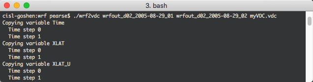

:orphan:

.. _convertWRFtoVDC:

Converting WRF data into VDC
============================

The two tools for converting WRF-ARW into VDC are ``wrfvdccreate`` and ``wrf2vdc``.  If either of these commands are issued by themselves, advanced options will be listed to the terminal.  These advanced options are usually not necessary.

Create .vdc metadata file
*************************

In the directory where Vapor 3 is installed, there is a command line utility called ``wrfvdccreate``.  Issue this command in a terminal (Unix) or command prompt (Windows), followed by your WRF-ARW files, and finally the name of the .vdc file to be written.

.. code-block:: c

   wrfvdccreate wrfout_d02_2005-08-29_02 katrina.vdc
    

    Creating a .vdc metadata file with ``wrfvdccreate``.

Generate VDC Data
*****************

Once we have a .vdc file, the metadata has been recorded and we can transform the data into the VDC format.  From Vapor 3's installation directory, issue the command ``wrf2vdc``, followed by your WRF-ARW files, and finally followed by the .vdc file that was made in Step 1.

.. code-block:: c

    wrf2vdce wrfout_d02_2005-08-29_02 katrina.vdc

    Applying the VDC transform to WRF-ARW data with ``wrf2vdc``
