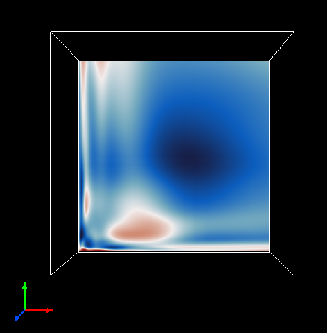

.. _stretchedGridExample:

Stretched Grids
---------------

Here we demonstrate how to use *xarray* to apply the CF Conventions to a basic NetCDF file (`simple.nc <https://drive.google.com/file/d/18CFrtFxvHwfL30Xd91TNU38J_z-Kgywm/view?usp=sharing>`_) to define it on a stretched grid, for ingesting into Vapor.  You can download this Python script ***NEED LINK*** that replicates the steps below.

Our simple.nc file only defines X, Y, and Z spatial dimensions, a time dimension, and one scalar variable named temperature.  To make it comply with the CF Conventions, we need to do the following:

    1) Create "coordinate variables" that define values for the values of our coordinates, along each dimension
    2) Assign "unit" attributes to our coordinate variables, and our scalar variable (temperature)
    3) Assign "axis" attributes to our coordinate variables to define their spatial and temporal axes

First import xarray.

.. jupyter-execute::

  import xarray as xr
  import numpy as np

Open our dataset with xarray.  Download `simple.nc <https://drive.google.com/file/d/18CFrtFxvHwfL30Xd91TNU38J_z-Kgywm/view?usp=sharing>`_ here, and point the following file path to your downloaded location.

.. jupyter-execute::

  from pathlib import Path
  from google_drive_downloader import GoogleDriveDownloader ad gdd

  # These are to download the sample data
  from pathlib import Path
  from google_drive_downloader import GoogleDriveDownloader as gdd
  
  # Download the sample data from google drive
  home = str(Path.home())
  simpleNC = home + "/simple1.nc"
  gdd.download_file_from_google_drive(file_id='18CFrtFxvHwfL30Xd91TNU38J_z-Kgywm',
                                     dest_path=simpleNC,
                                     unzip=False)    
  
  ds = xr.open_dataset(simpleNC)
  #ds = xr.open_dataset("/Users/pearse/CFConventions/data/simple.nc")

Now look at our simple.nc file, which defines X, Y, and Z spatial dimensions, a time dimension, and our scalar variable named temperature.  Note that our dataset is a 48x48x24 grid, with one timestep.

.. jupyter-execute::

  ds.info()

Now create coordinate variables to specify where our grid points exist in space, and the timestep of our file.  If your file already has spatial and temporal coordinate variables, skip this step.  Note: Coordinate variables must have the same name as their corresponding dimension.

.. jupyter-execute::

  ds['time'] = np.linspace(start=0, stop=0, num=1);
  
  # Generate coordinates for x, y, z dimensions using numpy's linspace 
  # https://numpy.org/doc/stable/reference/generated/numpy.linspace.html
  
  ds['y'] = np.geomspace(start=1, stop=100, num=48)
  ds['x'] = np.geomspace(start=1, stop=100, num=48)
  ds['z'] = np.geomspace(start=1, stop=50, num=24)

We now have our spatial grid points defined, and we know what timestep this data file refers to.

.. jupyter-execute::

  ds.info() 

Now that we have our coordinate variable values assigned, we need to state what spatial/temporal axis they apply to.

.. jupyter-execute::
 
  ds.time.attrs['axis']      = 'T'
  ds.x.attrs['axis']         = 'X'
  ds.y.attrs['axis']         = 'Y'
  ds.z.attrs['axis']         = 'Z'

And now we need to specify what units the coordinate variables are in.  The unit for our spatial coordinates are meters.  Note that when we created our *time* coordinate variable, the p

.. jupyter-execute::

  ds.time.attrs['units']     = 'seconds since 2000-0101'
  ds.x.attrs['units']        = 'm'
  ds.y.attrs['units']        = 'm'
  ds.z.attrs['units']        = 'm'

Next we add a unit attribute for our temperature variable.  If this were a velocity field, we would use 'm' instead of 'K'.
  
.. jupyter-execute::

  ds.temperature.attrs['units'] = 'K'

Now our dataset is CF Compliant, containing coordinate variables that have units, axes, and attributes, and a scalar variable with a unit attribute.

.. jupyter-execute::

  ds.info()

Finally, write our dataset to a new file.  Make sure you specify a valid local path.

.. jupyter-execute::

  ds.to_netcdf("/Users/pearse/CFConventions/data/stretchedCompliant.nc")

We can visualize a 2D cross section of our data doing the following:

.. jupyter-execute::

  ds.isel(time=0, z=0).temperature.plot(size=6, robust=True);

And here it is in Vapor, after importing it as a NetCDF-CF dataset:

