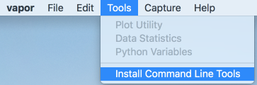
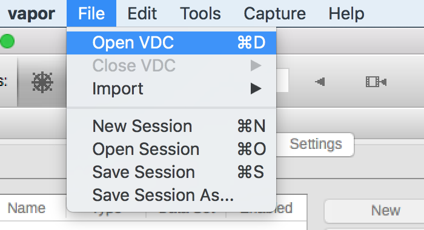

.. _vdc:

Big Data with VDC
`````````````````

If you import a very large dataset, you may experience performance issues.  In this case, you should consider the Vapor Data Collection (VDC).  The VDC data format allows users to render their data at different levels of compression.  Viewing compressed data reduces the time a rendering takes to complete, improving interactivity.  

With VDC, users can configure their renderers quickly at low fidelity, and then turn off compression for their final renderings.  Being able to interact with your data becomes important when rendering takes many seconds, minutes, or even hours to complete.

Creating a VDC is a two step process:

1) Create a .vdc metadata file that describes the structure of your data
2) Apply a wavelet transform to your data to create a new progressively accessible dataset

To do steps 1 and 2, you will need to choose a <format>vdccreate command and a <format>2vdc command from the list below, where <format> is your input data format (cf for NetCDF-CF, wrf for WRF-ARW, etc).  Not all of VAPOR's natively supported formats can be converted into VDC.

.. note::

    The new VDC dataset will be **twice** the size of your original dataset.  Be careful!

.. toctree::
    vdcConversionCommands.rst

Using the Command Line Tools
''''''''''''''''''''''''''''

Creating a VDC requires command line tools that come bundled with Vapor.  These tools can be found and issued in the installation directory.  For example, Windows users may find it in C:\Program Files\VAPOR\ and Linux users may find it in /home/john_doe/vapor/bin/wrf2vdc.

Alternatively, the tools can be added to the user's system path by clicking on the `Tools` menu, and selecting `Install Command Line Tools`.After doing this, users will be able to issue the command line utilities from any directory in their terminal or command prompt.

.. _commandLineTools:



    Installing the command line tools for VDC creation, through Vapor's GUI.

The two step VDC creation process is as follows:

    Step 1) Create a .vdc metadata file that describes the structure of your data

    Step 2) Transform the data values into VDC format

This process is supported with WRF-ARW, CF-Compliant NetCDF (NetCDF-CF), and Raw Binary data.

Once the conversion is complete, users can load VDC files into Vapor.  Read on for instructions for your data type.



    Loading a VDC into Vapor.
