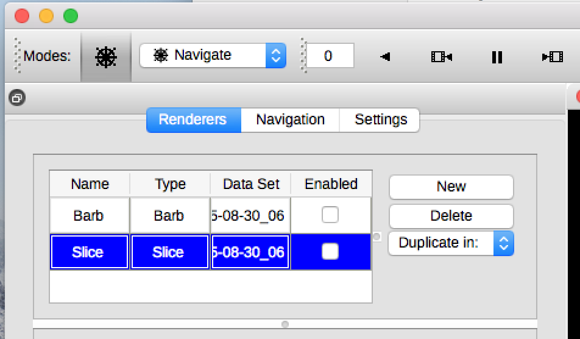
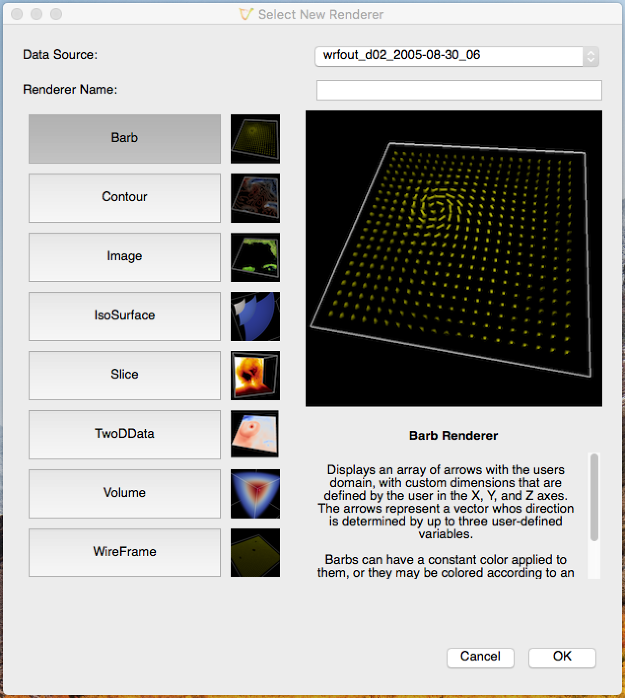

.. _quickStartGuide:

=================
Quick Start Guide
=================

Install the version of Vapor3 for your computer's operating system from our :ref:`downloads <downloads>` page.  Updating your system's graphics driver if you're not sure that it's current.

If you don't have :ref:`data that's supported <gettingDataIntoVapor>` by Vapor3 yet, you can :ref:`download a sample <sampleData>` to get started with.

Start Vapor3
````````````

After following the :ref:`installation instructions <installationInstructions>` for Vapor3, run the application by doing the following:

:OSX:

    Vapor3 will be located within your Applications folder.  Double click on Vapor3's icon.

:Windows:

    Unless you chose a different directory during installation, Vapor3 will exist in C:\\Program Files\\VAPOR\\vapor.exe.  Double click on the executable.

:Linux:

    From a BASH shell, navigate to the directory you installed Vapor3 into.  Then issue the following command:

    ::

        user@localhost:/vaporInstallDir$ bin/vapor

Import or Load Data
```````````````````

There are two ways to get data into Vapor3.  Once you've loaded data, we can create your first :ref:`Renderer <Renderers>`.

To load data, do one of the following from the ``File`` menu:

1. Load a .vdc file after converting your data into a :ref:`VDC`
    ``File->Open VDC``

2. Import your data, if it's one of the :ref:`natively supported data types <gettingDataIntoVapor>` (WRF, NetCDF-CF, MPAS)
    ``File->Import->[dataType]``

+------------------------------------------------+----+------------------------------------------------+
| Loading a .vdc file                            |    | Importing data                                 |
+------------------------------------------------+----+------------------------------------------------+
| .. image :: ../_images/loadData.png            | or | .. image :: ../_images/importWRF.png           |
+------------------------------------------------+----+------------------------------------------------+

Creating a Renderer
```````````````````
Now that we've loaded some data to visualize, we can create a new :ref:`Renderer <Renderers>`.

Vapor3 displays all of your renderers in a table in the upper left corner of the application.  Next to this table are controls that  let you create ``New`` renderers, ``Delete`` renderers, or ``Duplicate`` existing renderers.  



    Vapor3's Renderer Table.

Click on ``New``.  This will raise a window that will let you choose from the currently available renderers.  Pick the Slice Renderer by double-clicking on the ``Slice`` button.



    Vapor3's ``New Renderer`` Dialog

Notice that your new Slice Renderer has been added to the Renderer Table.  By default, all renderers are disabled after being created.  To enable your Slice renderer, click the ``Enabled`` checkbox in the Renderer Table that's in the same row as your new Slice.

Now that you have your first Renderer, you can do the following:

1. Change the displayed variable in the :ref:`Variables Tab <variablesTab>`
2. Change the color mapping of your variable in the :ref:`Appearance Tab <appearanceTab>`
3. Modify the orientation and region that your renderer is drawn to in the :ref:`Geometry Tab <geometryTab>`
4. Add annotations and color bars in the :ref:`Annotations Tab <annotationTab>`

At this point, we've created our first renderer.  To customize it, we need to get familiar with the four tabs listed above.  The :ref:`Variables Tab <variablesTab>` and :ref:`Appearance Tab <appearanceTab>` are the most important to get started with.  We also encourage you to watch active demonstrations in our :ref:`Video <videos>` archive.

If you have any questions, bug reports, or feature requests, see our :ref:`Help <getHelp>` section.  Thank you. 
