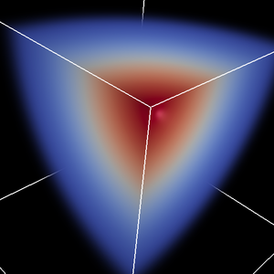
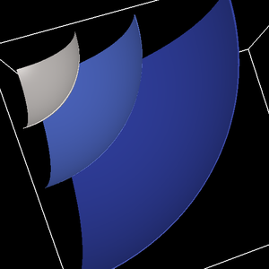
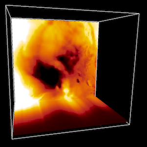
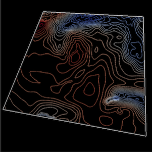
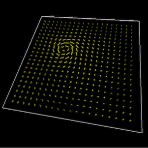
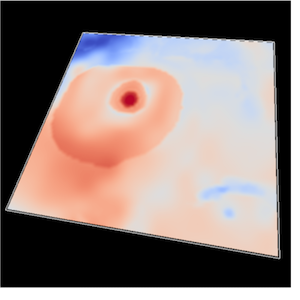
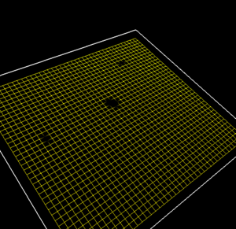

.. _renderers:

|

The Renderers
-------------

Volume Renderer
_______________

Displays the user's 3D data variables within a volume described by the source data file, according to color and opacity settings defined by the user.

Isosurfaces
___________

Displays the user's 3D data variables within a volume described by the source data file, according to color and opacity settings defined by the user.

Slices
______

Displays an axis-aligned slice or cutting plane through a 3D variable.  Slices are sampled along the plane's axes according to a sampling rate defined by the user.

Contours
________

Displays a series of user defined contours along a two dimensional plane within the user's domain.  Contours may have constant coloration.  Contours may be displaced by a height variable.

Barbs
_____

Displays an array of arrows with the users domain, with custom dimensions that are defined by the user in the X, Y, and Z axes.  The arrows represent a vector whose direction is determined by up to three user-defined variables. Barbs can have a constant color applied to them, or they may be colored according to an additional user-defined variable.

The Barb renderer may be offset by a height variable, if the barbs are referencing two-dimensional variables.

Two Dimensional Variables
_________________________

Displays the user's 2D data variables along the plane described by the source data file. These 2D variables may be offset by a height variable.

Georefernced Images 
___________________

Displays a georeferenced image that is automatically reprojected and fit to the user's data, as long as the data contains georeference metadata.  The image renderer may be offset by a height variable to show bathymetry or mountainous terrain.

.. figure:: ../../_images/Image.png
    :align: center
    :figclass: align-center

Wireframes
__________

Displays a wireframe of the mesh for the selected variable

|
