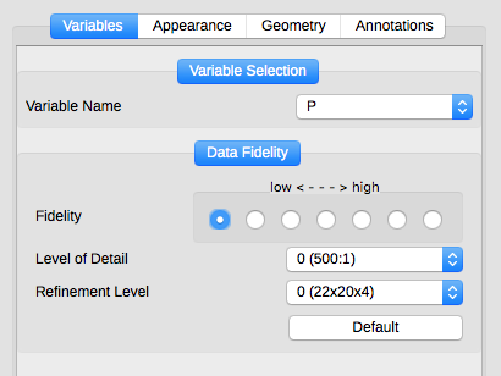
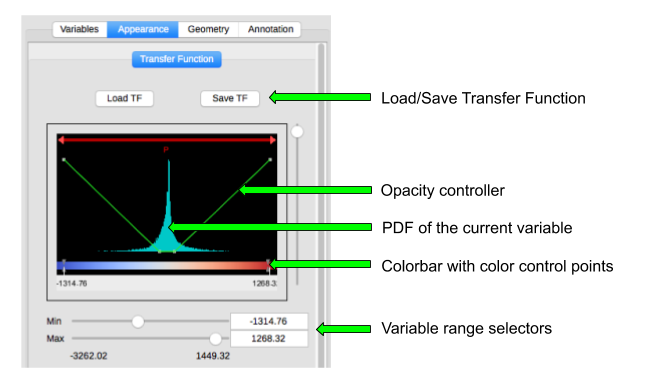
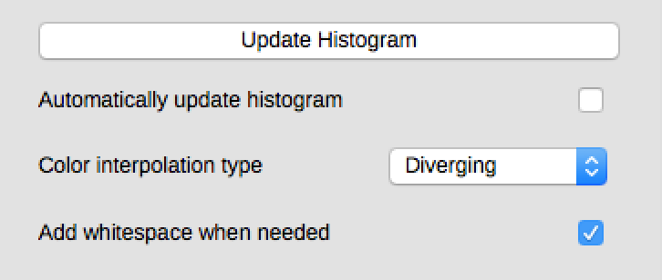
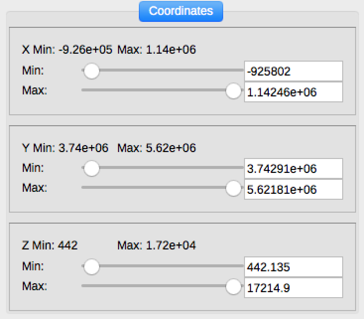
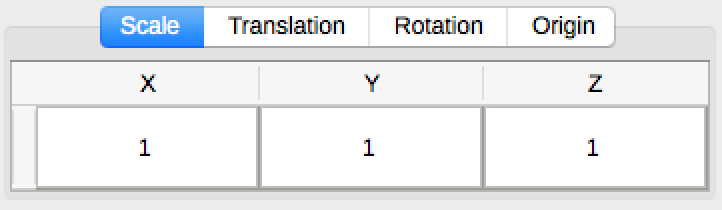
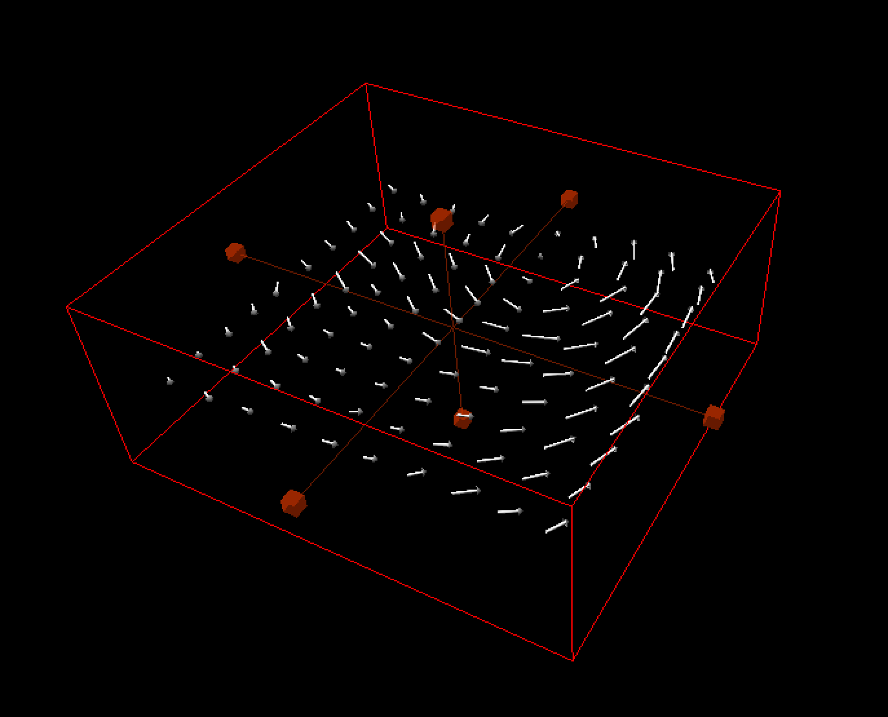
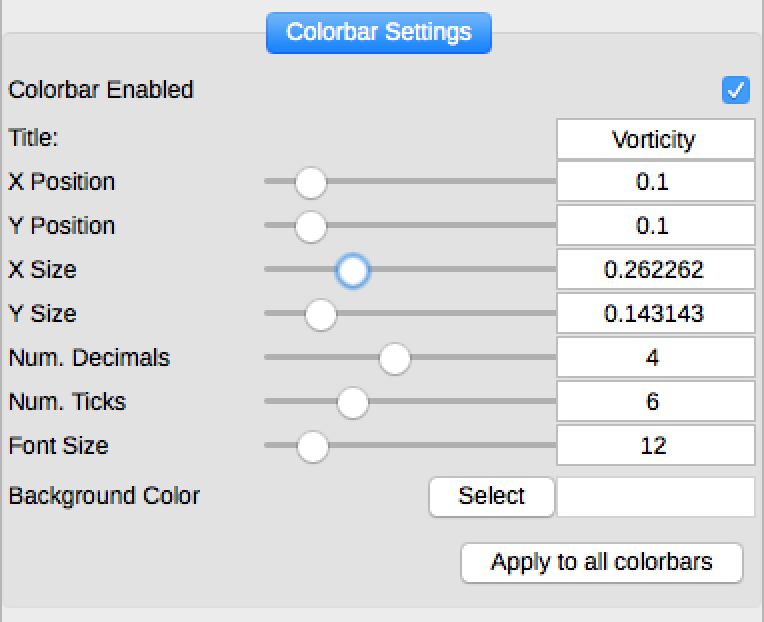
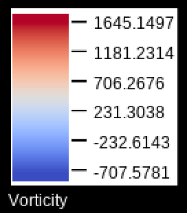

.. _basicRendererControls:

Basic Renderer Controls
_______________________

Each of Vapor's renderers has a common set of controls that will create imagery of your variables according to color, opacity, and region of interest.

While each renderer is unique, controlling their parameters is mostly the same.  All renderers are controlled by four tabs:

    - :ref:`Variables <variablesTab>`
    - :ref:`Appearance <appearanceTab>`
    - :ref:`Geometry <geometryTab>`
    - :ref:`Annotation <annotationTab>`

See the :ref:`Renderers <renderers>` section for more information on how each of these tabs work for a given renderer.  Again, they all operate in the same way for the most part.

    Variables tab for the Slice renderer

.. _variablesTab:

Variables Tab
-------------
The Variables Tab allows the user to define what variables are used as input to a renderer.  The options presented to the user in this tab depend on the renderer currently being used.

Users that have converted their data into :ref:`VDC <vdc>` will have a fidelity controller, which allows them to view compressed data to speed up their rendering time.  Making a visualization interactive lets you change parameters faster, so you can crank up the fidelity of your data for a final visualization after exploring first.

.. _appearanceTab:

Appearance Tab
--------------
The appearance tab controls the color, opacity, and any renderer-specific parameters of your renderer.  Color and opacity are controlled by the Transfer Function.  Renderer-specific parameters will be grouped together within the Appearance Tab.  See the :ref:`Renderers <renderers>` section for more info on renderer-specific parameters.

The Transfer Function consists of a `Probability Density Function (PDF) <https://en.wikipedia.org/wiki/Probability_density_function>`_ of your currently selected variable.  Underneath the PDF is a color bar that shows the colors that get applied to the values located directly above it.

    Vapor 3's Transfer Function editor

In the figure above, we can see that our transfer function is operating on the variable P.  The range of values within the transfer function are -1314.76 to 1268.32.  All values of P less than 1314.76 are colored deep blue.  The coloration transitions into red at the high end of the PDF, until becoming saturated at values of 1268.32 and higher.

Below the histogram is a button to update the histogram, which is calculated only when the user requests it to save on compute time.  Options to change the color interpolation type are also available.

    Additional options for the Transfer Function

.. _controllingColor:

Controlling Color
"""""""""""""""""

Vapor's default color map is called CoolWarm.  This is arbitrary, and may not suit your needs.  Vapor bundles several other color maps that can be found by pressing the "Load TF" button at the top of the Appearance tab.

The colors in the color map be moved by creating a color-control-point, and dragging it.  To create a new color-control-point, right click on the Colorbar, and then click "New Color Control Point."  The color at this control point may now be dragged to suit your needs.

.. figure:: ../_images/colorControlPoint.gif
    :align: center
    :figclass: align-center

    Adding and moving color control points in the Colorbar

These control points may also be given direct color values by either double clicking them, or right-clicking and selecting "Edit color control point".  After a color has been changed, Vapor will interpolate between control points to give a smooth color transition.

Controlling Opacity
"""""""""""""""""""

Opacity is controlled by the green line on top of the PDF.  The higher this green line is on the PDF's Y axis, the more opaque the colors will be at that point.  For example, the green bar is set to Y=0 over the blue values in the image below.  All of these values will be masked out.  The green bar then ramps up, and the values become more opaque, until we reach full opacity in the red region.

.. figure:: ../_images/opacityMap.png
    :align: center
    :width: 500 
    :figclass: align-center

    Blue values are hiden completely.  White values ramp up from transparent to opaque, and red values are fully opaque.

.. _geometryTab:

Geometry Tab
------------

The Geometry tab controls where your renderer is drawing, within the space of your simulation.  By excluding regions of data from being drawn, occluded features may be seen more clearly. Compute time will also be reduced, as well as the memory needed for a given renderer.

    Coordinate selector in the Geometry Tab
    
If you have a region of interest in another renderer, that region can be copied in the Geometry tab.

.. figure:: ../_images/copyRegionWidget.png
    :align: center
    :width: 500 
    :figclass: align-center

    Copy geometry from one renderer to another

Users can apply transforms to scale, translate, and rotate their renderers on X, Y, or Z.  The origin used for these transforms may also be adjusted.

    Transformation options within the Geometry widget

.. _regionMouseMode:

Users may also control the geometry of their renderer by using the `Region Mouse Mode`, located at the top left corner of the application.  This will enable a red box with handlebars that can be right-clicked to grow or shrink the region being rendered on any axis.

.. figure:: ../_images/selectRegionMouseMode.png
    :align: center
    :width: 400 
    :figclass: align-center

    Select the Region Mouse Mode for interactive geometry adjustment

    Interactive geometry controls alongside a Barb renderer, after activating the Region Mouse Mode

.. _annotationTab:

Annotation Tab
--------------

Quantifying the colors to your viewers can be done by adding a colorbar in the Annotation tab.

    Colorbar size and position controlls, located in the Annotation tab

    An exmaple colorbar

