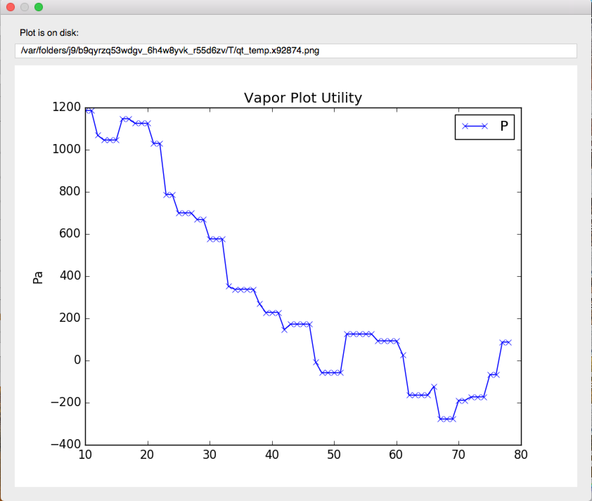

2D Plots
________

Users can generate two-dimensional line lots of their variables using the Plot Utility.  Line plots can be done either through two points in space at a s
ingle timestep, or through a single point across a timespan.

.. figure:: /_images/plotUtility.png
    :align: center
    :width: 500
    :figclass: align-center

    The user interface for hte Plot Utility

    An example of a line plot of Pressure through the spatial domain, at timestep 0
