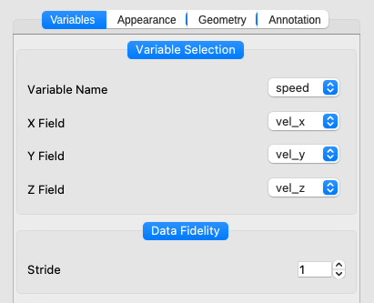
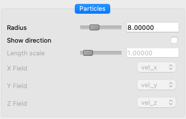

.. _particleRenderer:

Particle Renderer
_________________

.. raw:: html

    <iframe width="560" height="315" src="https://www.youtube.com/embed/iYuBMK0xIXo" title="YouTube video player" frameborder="0" allow="accelerometer; autoplay; clipboard-write; encrypted-media; gyroscope; picture-in-picture" allowfullscreen></iframe>

|

Description
-----------

The Particle Renderer displays `Lagrangian Particle Tracking <https://en.wikipedia.org/wiki/Lagrangian_particle_tracking>`_ data that is represented in the Data Collection Particles (DCP) file format.  DCP files are NetCDF files with a few requirements on NetCDF Dimensions, Coordainte Variables, and Attributes.  

The YouTube video above shows how to use the Particle Renderer, and also talks about the requirements behind a DCP NetCDF file.  DCP file requirements can also be found :ref:`here <dcp>`.

.. code-block:: default
   :caption: Example DCP NetCDF file header

    netcdf particles_000 {
    dimensions:
            P = 200 ;
            T = UNLIMITED ; // (1 currently)
            axis = 3 ;
    variables:
            double T(T) ;
                    T:units = "seconds" ;
            float Position(T, P, axis) ;
            float vel(T, P, axis) ;
            float speed(T, P) ;
    }

Variables Tab
-------------

The Particle Renderer's :ref:`Variables Tab <variablesTab>` allows the user to select a color mapped variable for the rendered particles.  

It also allows for selecting up to three field-variables that can show the particles's direction.  Enabling directionality can be done under the Appearance Tab.

The *Stride* parameter allows you to reduce the number of particles in your rendering.  It represents the sampling rate among the particles in your dataset.  A Stride of 2 would render 50% of your particles, Stride=3 would render 33.3%, Stride=4 would render 25%, etc...

|

Appearance Tab
--------------

The Particle Renderer's Appearance Tab contains a Transfer Function Editor that operates on the primary variable selected in the :ref:`Variables Tab <variablesTAb>`.

It also contains a *Particles* section, which can change the radius of your particles, and enable/disable directionality.  If *Show direction* is enabled, your selected field variables will be used to represent the vector of your choosing.

|

.. include:: commonControls/lightingParameters.rst

Geometry Tab
------------

The Particle Renderer's :ref:`Geometry <geometryTab>` behaves the same way as in othe renderers, allowing the user to spatially constrain the data being read and rendered, and allowing the user to transform their data.

Annotation Tab
--------------
The :ref:`Annotation <annotationTab>` tab also behaves in the same way as with other renderers, allowing the user to apply colorbars over their renderings.

