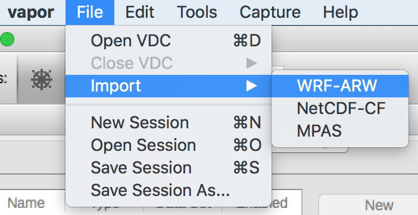
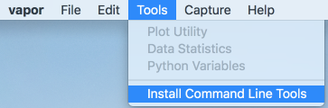
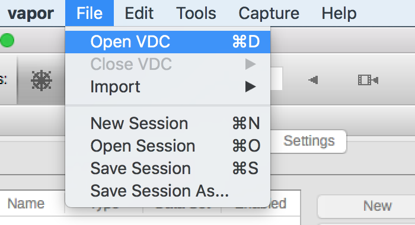
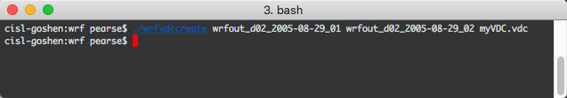
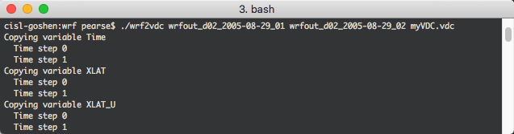
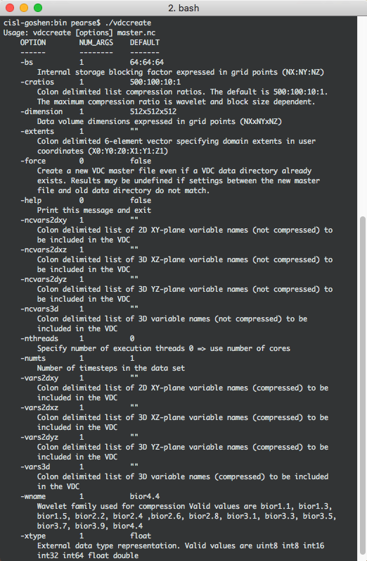
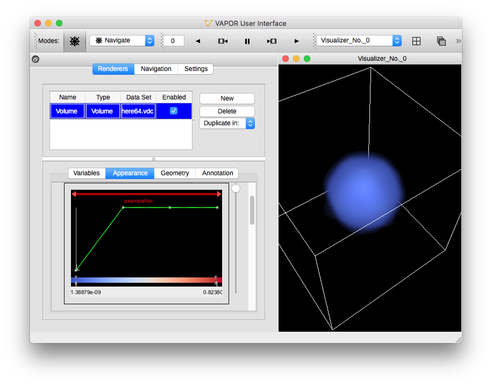
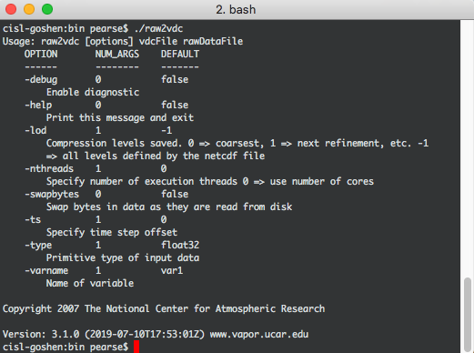

.. _gettingDataIntoVapor:

Getting Data into Vapor3
------------------------

Vapor can directly import the datasets listed below.  Some of them can be converted into the :ref:`VDC <vdc>` format if you are experiencing a performance bottleneck.  We strongly recommend that users start by importing their data and only convert VDC if necessary.

    - NetCDF files that follow the CF Convention (:ref:`NetCDF-CF <netCDF-CF>`)
    - WRF-ARW :ref:`wrf`
    - MPAS :ref:`mpas`

:ref:`Raw binary <binary>` data must be converted to VDC before loading into Vapor.

.. _importData:

Importing data 
``````````````

Users can import their data through Vapor's ``File`` menu.



    Importing WRF data into Vapor.

.. _vdc:

Vapor Data Collection (VDC)
```````````````````````````

In most cases, directly importing data is sufficient for an interactive user experience.  However, if rendering times keep the application from being interactive, users may want to consider using the VDC data foramt.

The VDC data format allows users to render their data at different levels of compression.  Viewing compressed data reduces the time a rendering takes to complete, improving interactivity.  

With VDC, users can configure their renderers quickly at low fidelity, and then turn off compression for their final renderings.  Being able to interact with your data becomes important when rendering takes many seconds, minutes, or even hours to complete.

.. toctree::
    referenceDocumentation.rst

Using the Command Line Tools
''''''''''''''''''''''''''''

Creating a VDC requires command line tools that come bundled with Vapor.  These tools can be found and issued in the installation directory.  For example, Windows users may find it in C:\Program Files\VAPOR\ and Linux users may find it in /home/john_doe/vapor/bin/wrf2vdc.

Alternatively, the tools can be added to the user's system path by clicking on the `Tools` menu, and selecting `Install Command Line Tools`.After doing this, users will be able to issue the command line utilities from any directory in their terminal or command prompt.

.. _commandLineTools:



    Installing the command line tools for VDC creation, through Vapor's GUI.

The two step VDC creation process is as follows:

    Step 1) Create a .vdc metadata file that describes the structure of your data

    Step 2) Transform the data values into VDC format

This process is supported with :ref:`WRF-ARW <wrf>`, :ref:`NetCDF-CF <netCDF-CF>`, and `raw binary data <binary>`.

Once the conversion is complete, users can load VDC files into Vapor.  Read on for instructions for your data type.



    Loading a VDC into Vapor.

.. _wrf:

WRF-ARW
```````

Vapor supports WRF-ARW model output, so it can be :ref:`directly imported <importData>`.

The two tools for converting WRF-ARW into VDC are ``wrfvdccreate`` and ``wrf2vdc``.  If either of these commands are issued by themselves, advanced options will be listed to the terminal.  These advanced options are usually not necessary.

Step 1: Create .vdc metadata file
_________________________________

In the directory where Vapor 3 is installed, there is a command line utility called ``wrfvdccreate``.  Issue this command in a terminal (Unix) or command prompt (Windows), followed by your WRF-ARW files, and finally the name of the .vdc file to be written.


    ``wrfvdccreate wrfout_d02_2005-08-29_02 katrina.vdc``



    Creating a .vdc metadata file with ``wrfvdccreate``.

Step 2: Transform data to VDC
_____________________________

Once we have a .vdc file, the metadata has been recorded and we can transform the data into the VDC format.  From Vapor 3's installation directory, issue the command ``wrf2vdc``, followed by your WRF-ARW files, and finally followed by the .vdc file that was made in Step 1.

    ``wrf2vdce wrfout_d02_2005-08-29_02 katrina.vdc``



    Applying the VDC transform to WRF-ARW data with ``wrf2vdc``

.. _netCDF-CF:

NetCDF and the CF Conventions
`````````````````````````````

If your NetCDF data follows the CF conventions, then the process of converting it to VDC is nearly identical to the WRF conversion process.  The commands that will be used are named *cfvdccreate* for .vdc metadata creation, and *cf2vdc* for applying the transform.

The `CF Conformance Checker <http://cfconventions.org/compliance-checker.html>`_ may be used to test if your data adheres to the standard.  Passing this checker does not guarantee that Vapor will read the data, but a failer is a strong indicator that Vapor will not be able to read the data.

In order for NetCDF data to be compliant with the CF conventions, the following conditions must be met for the file's vector, scalar, and coordinate variables.

Coordinate Variables
____________________

What is a "Coordinate Variable"?  From the CF1.X Definition:

*We use this term precisely as it is defined in section 2.3.1 of the NUG.  It is a one- dimensional variable with the same name as its dimension [e.g., time(time)], and it is defined as a numeric data type with values that are ordered monotonically. Missing values are not allowed in coordinate variables.*

The ``axis`` attribute
**********************

Each coordinate variable must have an ``axis`` attribute as follows:

    - ``X`` coordinate variables must contain an ``axis`` attribute that is equal to ``0`` or ``X``.
    - ``Y`` coordinate variables must contain an ``axis`` attribute that is equal to ``1`` or ``Y``.
    - ``Z`` coordinate variables must contain an ``axis`` attribute that is equal to ``2`` or ``Z``.
    - ``Time`` coordinate variables must contain an ``axis`` attribute that is equal to ``3`` or ``T``.

The ``units`` attribute
***********************

The Time coordinate variable **must** have a ``units`` attribute which must be identifiable by the Udunits library.  Suitable ``units`` attributes include:

    - seconds
    - s
    - days since 0001-01-01 00:00:00
    - seconds since 2011-01-01 00:00:00

Coordinate variables for the X, Y and Z axes may have an attribute that defines the units they are measured in.  These units will assiste vapor in creating renderings that are accurate between multiple datasets.  Some suitable values for the ``units`` attribute are:

    - degree_east
    - meters
    - m
    - km

Vertical Coordinates
********************

*Need to elaborate.  We currently support ocean_s_coordinate_g1 and ocean_s_coordinate_g2 when the vertical coordinate is dimensionless.  What about other cases?*

Missing Values
**************

Variables with missing data values must have the attribute *_FillValue* or *missing_value* specified.  See section 2.5.1 of the CF 1.6 specification for more information.

Step 1: Create .vdc metadata file 
_________________________________

Once your NetCDF files have attributes that make them CF compliant, you may produce VDC by doing the following.

In the directory where Vapor 3 is installed, there is a command line utility called *cfvdccreate*.  Issue this command in a terminal (Unix) or command prompt (Windows), followed by your NetCDF-CF files, and finally the name of the .vdc file to be written.

Typing the command *cfvdccreate* alone will display the optional arguments that may be used, but these are usually not necessary.

Step 2: Transform to VDC
________________________

.. _binary:

Raw Binary Data
```````````````

Converting raw binary data to VDC is a complex process for converting data in Vapor 3.  With WRF-ARW and NetCDF-CF data, Vapor can read the files an extract metadata that describes the grid that the data exists within.  With raw binary data, we need to define that metadata ourselves in step 1.

Step 1: Create .vdc metadata file
_________________________________

To make a VDC from scratch, users need to carefully read all options in the ``vdccreate`` utility, and define their .vdc metadata file accordingly.

In this `sample dataset of a sphere <https://drive.google.com/open?id=1wJtPX0DPgovZSulAC8kntDKVcDkTw1Y7>`_, we have a 64x64x64 rectilinear grid with one timestep, and one 3D variable.  For this example, we can create a .vdc metadata file with the following flags from vdccreate.  Note that we are not using the raw data file yet, just defining the grid, time dimension, and variables.

    ``vdccreate -dimension 64x64x64 -numts 1 -vars3d exampleVar sphere64.vdc``



    Command line arguments for vdccreate, seen by issuing the command without any arguments

Step 2: The wavelet transform
_____________________________

Now that a .vdc metadata file has been created, the VDC transform can take place.  Each variable must be converted individually with ``raw2vdc``, and this must be done one timestep at a time.

    ``raw2vdc -ts 0 -varname exampleVar sphere64.vdc sphere64.raw``



    A volume rendering of our sphere, converted from raw binary data.



    Command line arguments for raw2vdc wavelet transform, seen by issuing the command without any arguments.
