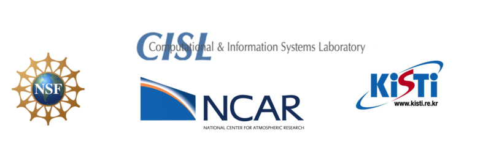

.. Vapor documentation master file, created by
   sphinx-quickstart on Mon Feb 11 14:40:12 2019.
   You can adapt this file completely to your liking, but it should at least
   contain the root `toctree` directive.

.. .. image:: vaporNCARLogoWhite2.png    
..    :scale: 10%
..    :align: right

.. |
.. |

Vapor 3
=================================

VAPOR is the Visualization and Analysis Platform for Ocean, Atmosphere, and Solar Researchers. VAPOR provides an interactive 3D visualization environment that can also produce animations and still frame images. VAPOR runs on most UNIX and Windows systems equipped with modern 3D graphics cards.

The VAPOR Data Collection (VDC) data model allows users progressively access the fidelity of their data, allowing for the visualization of terascale data sets on commodity hardware. VAPOR can also directly import data formats including WRF, MOM, POP, ROMS, and some GRIB and NetCDF files.

Users can perform ad-hoc analysis with VAPOR’s interactive Python interpreter; which allows for the creation, modification, and visualization of new variables based on input model data.

VAPOR is a product of the National Center for Atmospheric Research’s Computational and Information Systems Lab. Support for VAPOR is provided by the U.S. National Science Foundation (grants # 03-25934 and 09-06379, ACI-14-40412), and by the Korea Institute of Science and Technology Information

.. toctree::
   :caption: Contents:

   downloads
   quickStartGuide
   gettingDataIntoVapor
   usage
   Get Help on Our Forum <https://vapor.discourse.group>
   contributing
   licenseAndCitation

Indices and tables
==================

* :ref:`genindex`
* :ref:`modindex`
* :ref:`search`
