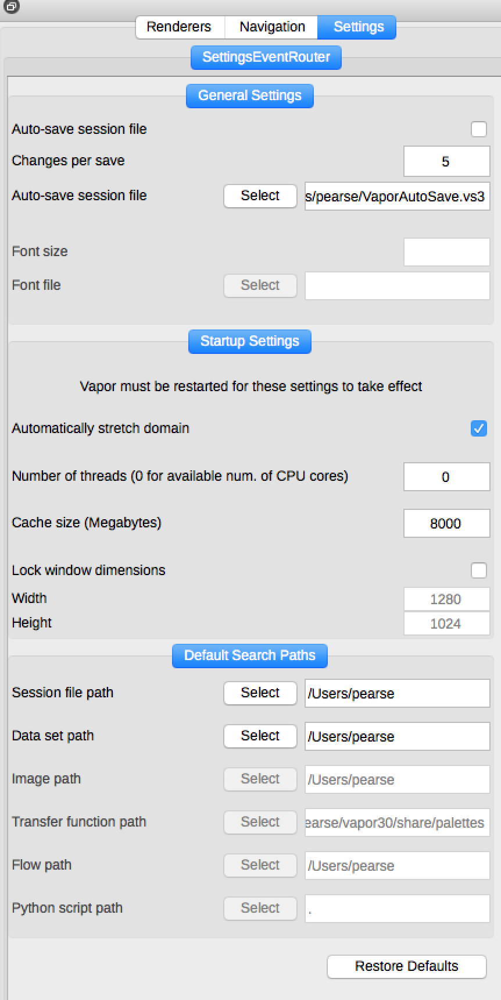

Global Settings
---------------

The last top-level tab next to the Renderers and Navigation tabs is called Settings.  This is where Vapor's session file save frequency is set, as well as programatic settings like window sizes and cache sizes.

    The top-level Settings Tab
